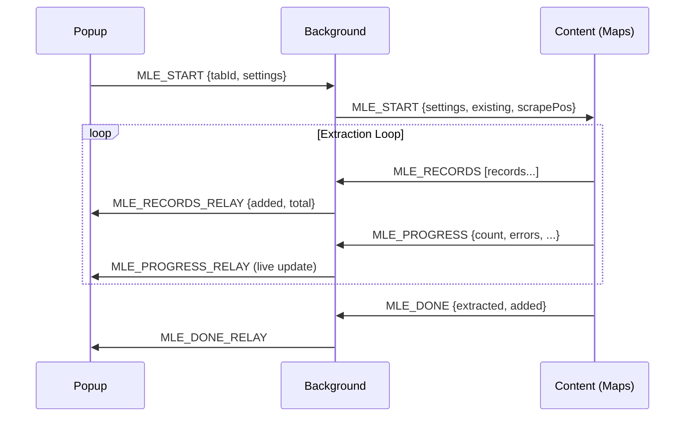

# Google Maps Lead Extractor

> Professional Chrome extension for extracting business data from Google Maps with deep email/social media extraction.


---

## Overview

Google Maps Lead Extractor is a Chrome extension that automates the collection of publicly visible business listings from Google Maps. It features deep email extraction, social media link discovery, anti-bot detection, and export to CSV/XLSX/JSON formats.

**No login. No API keys. No server. All data stays in your browser.**

---

## Features

| Feature | Description |
|---------|-------------|
| **Auto-scrolling** | Automatically scrolls through Google Maps search results |
| **Deep Email Extraction** | Crawls business websites and contact pages for emails |
| **Social Media Discovery** | Extracts Instagram, Facebook, YouTube, LinkedIn, Twitter/X links |
| **Cloudflare Decode** | Decodes `data-cfemail` protected email addresses |
| **Anti-Bot Detection** | Detects Google `/sorry` verification pages and pauses |
| **Resume Capability** | Pauses and resumes extraction without losing progress |
| **Smart Deduplication** | Prevents duplicate entries using name, address, and CID |
| **CID & Place ID** | Extracts Google-internal identifiers for each business |
| **Multi-format Export** | CSV (UTF-8 BOM), XLSX (SheetJS), JSON |
| **Dark/Light Themes** | Toggle between themes |
| **Live Progress** | Real-time extraction statistics and log console |

---

## Data Fields Extracted

| Field | Source | Description |
|-------|--------|-------------|
| `name` | Maps DOM | Business name |
| `category` | Maps DOM | Business category |
| `rating` | Maps DOM | Star rating (1-5) |
| `reviews` | Maps DOM | Number of reviews |
| `address` | Maps DOM | Full street address |
| `phone` | Maps DOM | Phone number |
| `website` | Maps DOM | Business website URL |
| `google_maps_url` | Maps DOM | Direct Maps link |
| `hours` | Maps DOM | Working hours (when available) |
| `latitude` | Maps DOM | GPS latitude |
| `longitude` | Maps DOM | GPS longitude |
| `cid` | Maps DOM | Google Customer ID |
| `place_id` | Maps DOM | Google Places ID |
| `email` | Deep extraction | Contact email from website |
| `instagram` | Deep extraction | Instagram profile URL |
| `facebook` | Deep extraction | Facebook page URL |
| `youtube` | Deep extraction | YouTube channel URL |
| `linkedin` | Deep extraction | LinkedIn company page |
| `twitter` | Deep extraction | Twitter/X profile URL |

---

## Installation

### Option 1: From Source (Recommended)

```bash
git clone https://github.com/vaibhav2694p/google-data-scraper.git
cd google-data-scraper
```

1. Open Chrome and navigate to `chrome://extensions/`
2. Enable **Developer mode** (top-right toggle)
3. Click **Load unpacked**
4. Select the `maps-extractor/maps-extractor` folder (the inner folder containing `manifest.json`)

### Option 2: Download ZIP

1. Download the repository as ZIP
2. Extract the ZIP file
3. Follow steps 1-4 above

---

## Usage

1. **Open Google Maps** and search for businesses (e.g., "restaurants in New York")
2. **Click the extension icon** in your Chrome toolbar
3. **Configure settings**: keyword, filters, delays, max results
4. **Click "Start"** to begin extraction
5. **Monitor progress** in the popup dashboard
6. **Export data** as CSV, XLSX, or JSON when complete

### Quick Search

Use the search bar in the popup to open Google Maps with your query directly:
- Type your search (e.g., "dentists in London")
- Click the search button or press Enter
- A new Maps tab opens — click Start to extract

---

## Configuration

### Basic Settings

| Setting | Default | Description |
|---------|---------|-------------|
| Keyword | (empty) | Label for the extraction session |
| Min Rating | (none) | Filter by minimum star rating |
| Min Reviews | (none) | Filter by minimum review count |
| Required Fields | (none) | Skip listings missing these fields |

### Advanced Settings

| Setting | Default | Description |
|---------|---------|-------------|
| Scroll Delay | 1500ms | Delay between scrolls (500-10000ms) |
| Max Results | 500 | Maximum listings to extract |
| Auto-save | On | Save progress automatically |
| Dedup | On | Skip already-extracted listings |
| Jitter | On | Add random delay variation |
| Deep Email Search | On | Crawl websites for contact emails |

---

## Architecture

```
┌─────────────────────────────────────────────────────────┐
│                    Extension Popup                       │
│  popup.html + popup.js + popup.css                      │
│  Search bar, controls, settings, export, logs           │
└────────────────────┬────────────────────────────────────┘
                     │ chrome.runtime.sendMessage
                     ▼
┌─────────────────────────────────────────────────────────┐
│               Background Service Worker                  │
│  background.js + sorry.js (importScripts)               │
│  Message relay, deep extraction, anti-bot, storage      │
│  chrome.webRequest for /sorry detection                 │
└────────────────────┬────────────────────────────────────┘
                     │ chrome.tabs.sendMessage
                     ▼
┌─────────────────────────────────────────────────────────┐
│                 Content Script (Maps tab)                │
│  content.js + selectors.js + helpers.js + validators.js │
│  DOM scraping, auto-scroll, card extraction             │
└─────────────────────────────────────────────────────────┘
```

### Message Flow



### File Structure

```
maps-extractor/
├── manifest.json              # Chrome extension manifest (MV3)
├── background.js              # Service worker
├── sorry.js                   # Anti-bot /sorry detection
├── content.js                 # DOM extraction + auto-scroll
├── popup.html                 # Dashboard UI
├── popup.css                  # Dashboard styles (dark/light)
├── popup.js                   # Dashboard controller
├── storage.js                 # Chrome storage wrapper
├── export.js                  # CSV/XLSX/JSON export
├── utils/
│   ├── helpers.js             # Utilities (sleep, retry, debounce)
│   ├── selectors.js           # DOM selectors + social patterns
│   └── validators.js          # Field validation
├── libs/
│   └── xlsx.full.min.js       # SheetJS (945KB)
└── assets/                    # Extension icons
```

---

## Key Capabilities

### Deep Email Extraction

When enabled, the extension fetches each business website and:

1. Scans for email addresses in HTML
2. Decodes Cloudflare-protected emails (`data-cfemail`)
3. Visits common contact pages (`/contact`, `/about`, `/team`)
4. Filters out irrelevant emails (noreply, image placeholders)
5. Prioritizes emails matching the business domain

### Anti-Bot Detection

The extension monitors for Google's verification pages:

1. Tracks HTTP redirect chains via `webRequest` API
2. Detects `/sorry` URLs in redirects
3. Opens verification tab for user completion
4. Monitors tab until verification completes
5. Applies cooldown before resuming extraction

### Resume Capability

All extraction state is persisted in `chrome.storage.local`:
- Processed card index
- Scroll position and feed height
- Dedup sets (names, URLs, CIDs)
- Existing dataset
- Scrape position for next session

---

## Chrome APIs Used

| API | Purpose |
|-----|---------|
| `storage.local` | Persistent data storage |
| `tabs` | Tab management for verification |
| `scripting` | Dynamic script injection |
| `downloads` | File download handling |
| `alarms` | Service worker keepalive |
| `webRequest` | Redirect monitoring |
| `runtime.sendMessage` | Inter-context communication |

---

## MV3 Compatibility

- Service worker 30s idle timeout handled via keepalive alarm (0.2min interval)
- All state persisted to storage — survives service worker restarts
- Safe message passing with error handling throughout
- No `eval()` usage — security compliant
- `sorry.js` loaded via `importScripts()` in background context only

---

## Privacy & Ethics

- **Public data only** — extracts only publicly visible information
- **No authentication** — does not require login or API keys
- **Local storage** — all data stays in your browser
- **No tracking** — no analytics, telemetry, or external calls
- **Rate limiting** — built-in configurable delays to be respectful

---

## Version History

| Version | Changes |
|---------|---------|
| **v2.0.1** | Fixed sorry.js context (content_scripts → background), host permissions, removed forbidden User-Agent header, added Cloudflare email decode, social link normalization, /sorry detection during deep extraction |
| **v2.0.0** | Added deep email/social extraction, CID & Place ID, anti-bot detection, SheetJS XLSX export, deep email search toggle |
| **v1.0.0** | Initial release — DOM extraction, CSV/JSON export, resume capability |

---

## FAQ

**Q: Does this work without a Google account?**
A: Yes. No login is required. The extension extracts publicly visible data from Maps.

**Q: Will this get my Google account banned?**
A: The extension works with public data only. It includes anti-bot detection and rate limiting. Use responsibly.

**Q: Can I extract 1000+ results?**
A: Yes. Set max results to your desired count. The extension will scroll and extract until the limit is reached or results run out.

**Q: How accurate is the deep email extraction?**
A: It depends on the business website. The extension checks the homepage, contact pages, and common paths. Some businesses don't list emails publicly.

---

## Credits

Created by **Vaibhav Patel**

- [LinkedIn](https://www.linkedin.com/in/vaibhav-patel-b14267227/)
- [Portfolio](https://vaibhav2694p.github.io/vaibhav-portfolio-v2/)
- [GitHub](https://github.com/vaibhav2694p)

---

## License

MIT License — Use responsibly and ethically.
